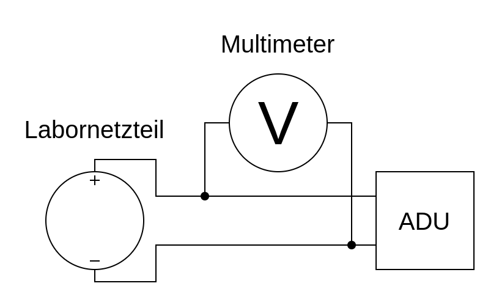

# ADC

## Main Purpose

I measured how accurate diverse analog digital converters (ADC) are...

## Circuit Diagrams

- For the voltage measurement:

- For the measurement with 55 V --> I simply added a 100 kOhm and 10 kOhm voltage divider

## Software

- [Arduino](https://github.com/PaulusElektrus/ADC_Uno)
- [ESP32](https://github.com/PaulusElektrus/ADC_ESP32)
- [ADS1115](https://github.com/PaulusElektrus/Arduino_and_ADS1115)

## Plots

Can be found under /results.

## Findings

- ESP32 ADC is very unprecise und unlinear --> Not usable for my project
- Arduino Uno is only 10 bit but very precise and linear --> Good usable for my project
- ADS1115 is with the integrated Vref and 16bit the best choice over all!