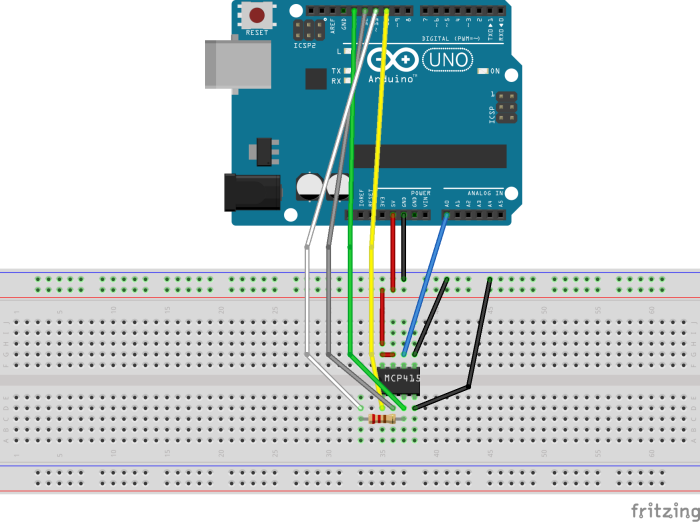

# MCP4151

## Circuit Diagram

- The -nm plots are made with this circuit:

- For the -cp circuit Vcc and Gnd are changed at pins 5 & 7 respective P0A & P0B
I just wanted to check if there is a difference in how deep the resistance can get...

## Software

[Here](https://github.com/PaulusElektrus/Arduino_and_MCP4151) you can find the software which ran on the Arduino to generate the data.

## Plots

Can be found under /results.