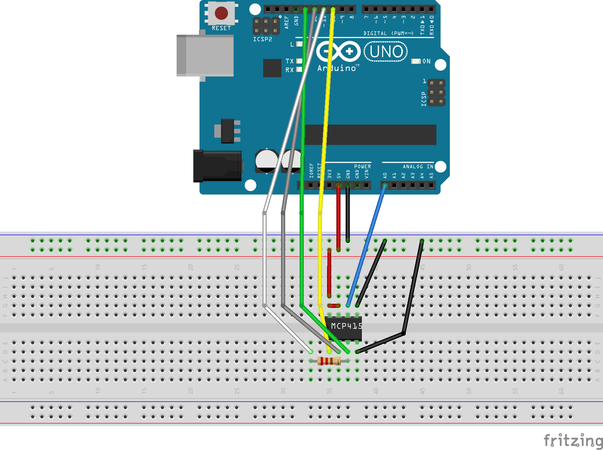

# MCP4151

## Circuit Diagram

## Software

[Here](https://github.com/PaulusElektrus/Arduino_and_MCP4151) you can find the software which ran on the Arduino to generate the data.

## Plots

Can be found under /results.