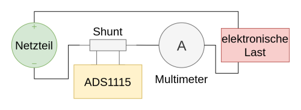
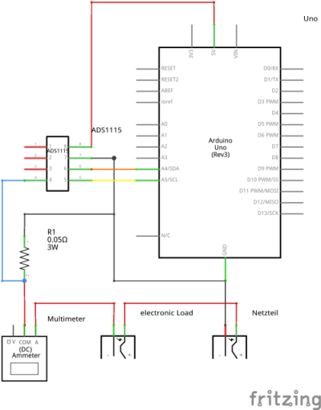
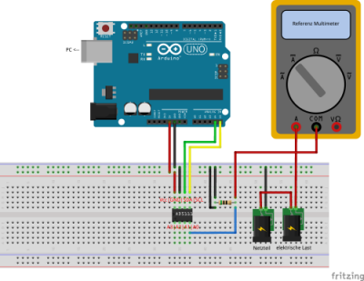
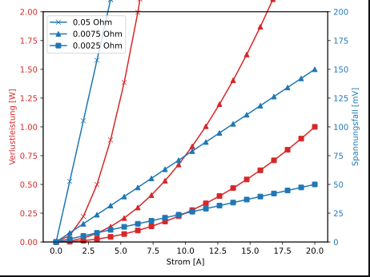

# Shunt Current Measurement

##  Main Purpose

I measured how accurate Shunt current measurement is...

- 0.1 Ohm shunt (self built) with Arduino ADC
- 0.05 Ohm shunt (self built) with ADS1115 ADC & Arduino
- 0.0075 Ohm shunt with ADS1115 ADC & Arduino
- 0.0025 Ohm shunt with ADS1115 ADC & Arduino

## Circuit Diagrams

- For the 0.1 Ohm shunt with Arduino: Will follow perhaps...

- For the ADS1115 measurement:

## Software

- [Shunt](https://github.com/PaulusElektrus/Uno_Shunt)
- [ADS1115](https://github.com/PaulusElektrus/Arduino_and_ADS1115)

## Plots

Can be found under /results.

## Findings

- The 0,1 Ohm shunt results with the arduino are acceptable, but with 3 A shunt is getting warm (3 A * 3 A * 0.1 Ohm = 0.9 Watt) and results are getting bad...
- Also there is some unlinearity
- To compare with Hall Sensor see [here](https://github.com/PaulusElektrus/MA-Plots/tree/main/Hall_Sensor/results)

- The 0.05 Ohm shunt in combination with ADS1115 works perfectly fine and with 3 A (3 A * 3 A * 0.05 Ohm = 0.45 Watt) the shunt is not getting warm. 
- Results are very good with maximal 50 mA deviation

- Professional Shunts 0,0025 & 0,0075 Ohm are very precise and a good choice

## Design Considerations based on

